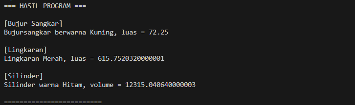

# Tugas PBO

Di dalam repo ini, terdapat implementasi kode Java untuk memenuhi tugas Pemrograman Berorientasi Objek. Program disusun untuk mendemonstrasikan tiga pilar utama OOP. Berikut adalah rincian penerapannya pada baris kode:

### 1. Enkapsulasi (Pembungkusan Data)
Data atau variabel pada masing-masing bangun datar diisolasi agar aman dari modifikasi eksternal yang tidak semestinya. 
* Pada class `BujurSangkar` dan `Silinder`, variabel dimensinya (seperti `sisi` dan `tinggi`) dikunci dengan *modifier* `private`.
* Khusus untuk class `Lingkaran`, atribut `radius` menggunakan *modifier* `protected`, sehingga nilainya tersembunyi dari luar kelas umum, namun masih bisa diakses langsung oleh class turunannya.
* Untuk membaca atau mengubah isi variabel-variabel tersebut dari file Main, program harus memanggil jalur resmi berupa *method getter* (misal: `getSisi()`) dan *setter* (misal: `setSisi()`).

### 2. Inheritance (Pewarisan)
Sesuai dengan prinsip relasi *is-a*[cite: 7, 8], class anak (subclass) akan mewarisi atribut maupun *method* non-private dari class induknya (superclass) tanpa perlu menulis ulang kodenya[cite: 7, 8]. 
* Konsep pewarisan tunggal (*single inheritance*)[cite: 7, 8] terlihat dari penggunaan kata kunci `extends` saat class `BujurSangkar` dan `Lingkaran` diturunkan dari superclass `Bentuk`. Keduanya otomatis mewarisi fungsi dan atribut `warna`.
* Terdapat juga pewarisan bertingkat, di mana class `Silinder` adalah turunan dari class `Lingkaran`. Praktik ini terbukti sangat efisien karena saat mencari volume silinder, kodenya cukup mendaur ulang logika dengan memanggil `super.hitungLuas()` milik class induknya.

### 3. Polimorfisme
Program ini memanfaatkan kemampuan polimorfisme melalui teknik *Method Overriding*, yaitu menimpa *method* dari superclass agar subclass memiliki perilakunya sendiri yang lebih spesifik[cite: 7, 8]. 
* *Method* `printInfo()` pada dasarnya sudah dideklarasikan di class `Bentuk`.
* Namun, class `BujurSangkar`, `Lingkaran`, dan `Silinder` mendefinisikan ulang *method* tersebut menggunakan anotasi `@Override`. 
* Hasilnya, ketika `printInfo()` dipanggil di kelas Main, output yang dicetak ke layar akan beradaptasi dan berbeda-beda mengikuti identitas masing-masing objek bangun datarnya.

### Screenshot Hasil Program
